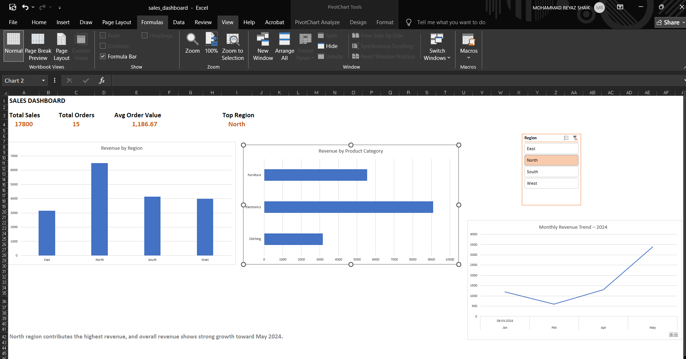
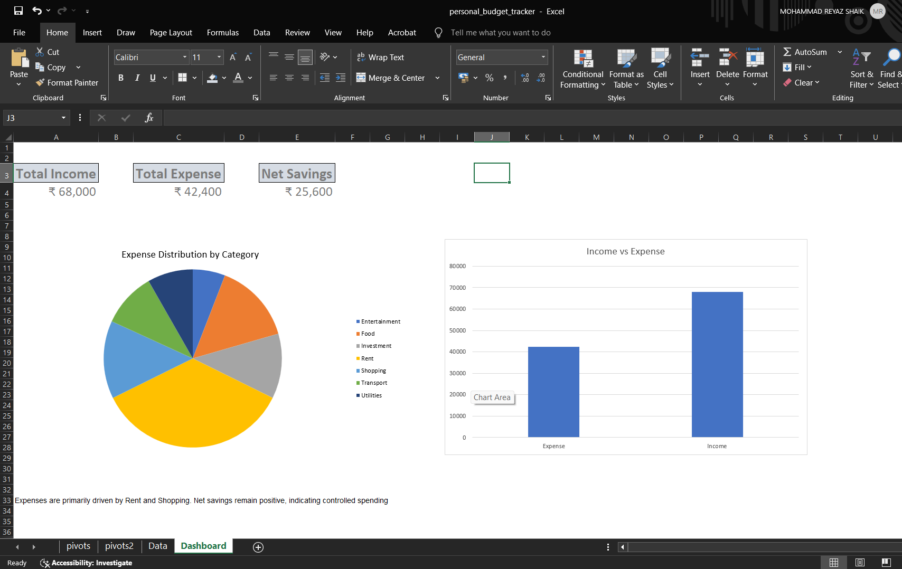

# 📊 Data Analytics Portfolio – Excel (Week 1)

This repository documents my structured Excel learning journey as part of my Data Analyst preparation roadmap.

During Week 1, I focused on building strong foundations in:

- Excel formulas and functions  
- Data cleaning and validation  
- Lookup operations (VLOOKUP, INDEX + MATCH)  
- Pivot table analysis  
- Interactive dashboard creation  
- Business insight extraction  

---

## 👤 About This Portfolio

This portfolio showcases hands-on Excel projects built using real-world style datasets.  
Each project demonstrates not only technical Excel skills but also analytical thinking and reporting ability.

---

## 🛠 Skills Demonstrated

- Data Cleaning & Validation  
- Removing Duplicates  
- Handling Missing Values  
- Standardizing Text & Date Fields  
- Structured Excel Tables  
- VLOOKUP  
- INDEX + MATCH  
- Logical Functions (IF, COUNTIF)  
- Pivot Tables  
- Pivot Charts  
- Slicers (Interactive Filtering)  
- KPI Dashboard Design  

---

# 🟢 Day 1 – Excel Fundamentals

### 🎯 Objective
Build foundational Excel skills using structured employee compensation data.

### 🔎 Key Tasks
- Calculated Total Compensation  
- Used SUM, AVERAGE, COUNT, COUNTIF  
- Applied Conditional Formatting  
- Practiced Relative & Absolute References  

### 📷 Preview

---

# 🟢 Day 2 – Lookup & Logical Functions

### 🎯 Objective
Merge datasets and categorize salary data using lookup and logical functions.

### 🔎 Key Tasks
- Merged data using VLOOKUP  
- Implemented INDEX + MATCH as a flexible lookup alternative  
- Categorized salary levels using IF  
- Counted high earners using COUNTIF  

### 📷 Preview

---

# 🟢 Day 3 – Data Cleaning & Validation

### 🎯 Objective
Transform messy sales dataset into structured, analysis-ready data.

### 🧹 Cleaning Process
- Removed duplicate records based on Order ID  
- Standardized city names  
- Corrected inconsistent date formats  
- Replaced missing Sales values after validation  
- Verified numeric columns using SUM and AVERAGE  

### 📊 Results
- Total Sales: 2600  
- Average Sales: 520  
- Total Orders: 5  

### 📷 Preview

---

# 🟢 Day 4 – Pivot Table Analysis

### 🎯 Objective
Summarize cleaned sales data to generate business insights using Pivot Tables.

### 📊 Analysis Performed
- Revenue by Region  
- Revenue by Category  
- Monthly Sales Trend (Grouped by Month)  
- Top 5 Customers  

### 📷 Preview

---

# 🟢 Sales Dashboard Project

### 🎯 Objective
Built an interactive Excel dashboard to analyze retail sales performance using KPI metrics, PivotTables, charts, and slicers.

### 📊 Dashboard Features
- KPI Cards:
  - Total Sales: 17,800  
  - Total Orders: 15  
  - Average Order Value: 1,186.67  
  - Top Region: North  
- Revenue by Region (Column Chart)  
- Revenue by Product Category (Bar Chart)  
- Monthly Revenue Trend – 2024 (Line Chart)  
- Interactive Region Slicer  

### 📈 Key Insight
The North region contributes the highest revenue, and overall revenue shows strong growth toward May 2024.

### 📷 Preview

---
---

# 🟢 Personal Budget Tracker

### 🎯 Objective
Built a personal financial tracking dashboard using Excel to monitor income, expenses, and savings.

### 📊 Features
- KPI Cards:
  - Total Income: 68,000  
  - Total Expense: 42,400  
  - Net Savings: 25,600  
- Expense Distribution by Category (Pie Chart)
- Income vs Expense Comparison (Column Chart)

### 📈 Key Insight
Rent and Shopping drive the highest expenses, while overall savings remain positive, indicating controlled spending.

### 📷 Preview

# 🎤 Interview Talking Points

I can confidently explain:

- Why PivotTables are more efficient than manual formulas  
- How to troubleshoot date grouping issues  
- The difference between VLOOKUP and INDEX + MATCH  
- The importance of data cleaning before analysis  
- How KPI dashboards support business decision-making  
- How slicers enable interactive reporting  

---

# 🚀 Next Steps

Week 2:
- Advanced Excel functions  
- Enhanced dashboard styling  
- KPI reporting improvements  

Week 3:
- SQL for Data Analysis  

---

## 📌 Goal

To build strong analytical foundations and develop job-ready Data Analyst skills through structured, documented projects.
