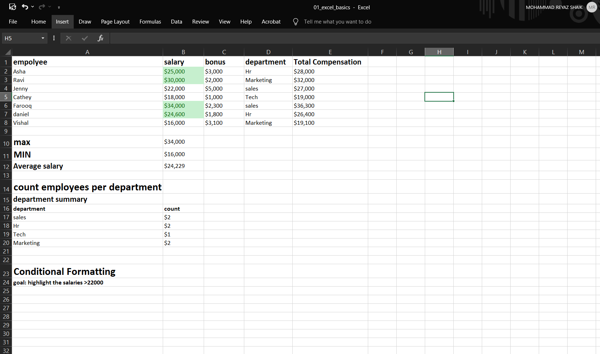
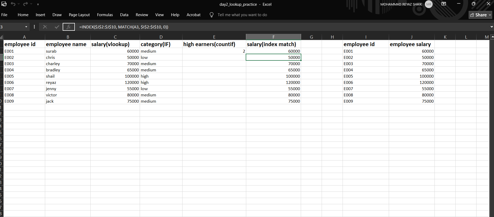
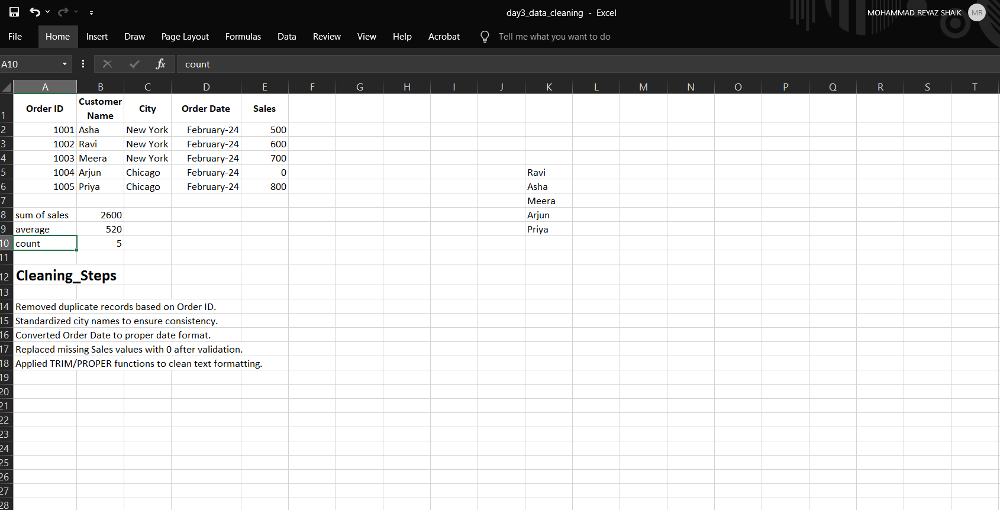
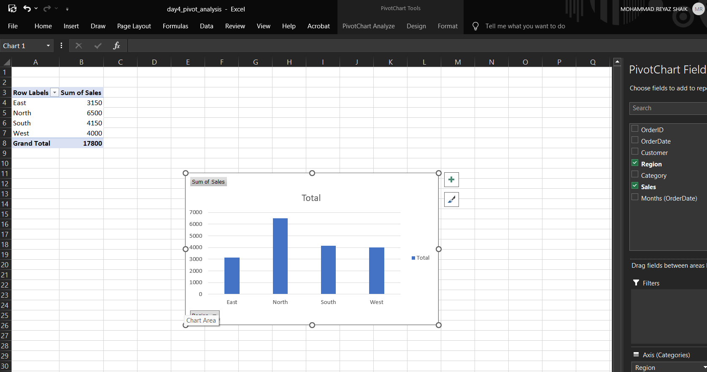
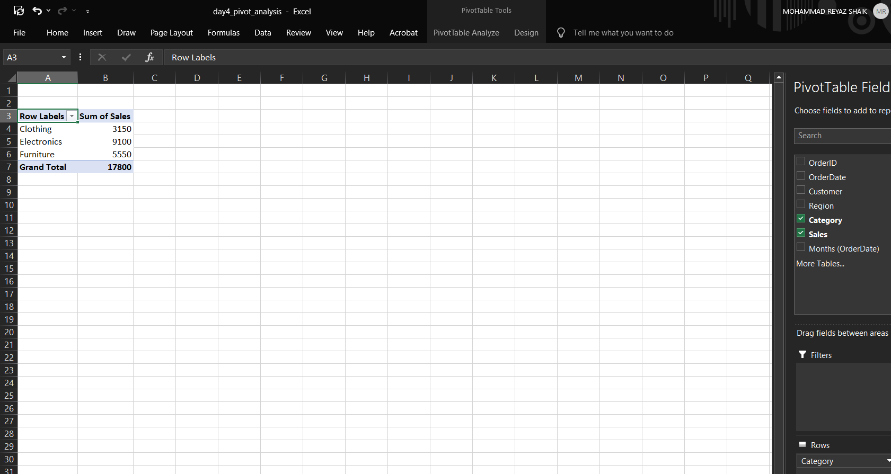
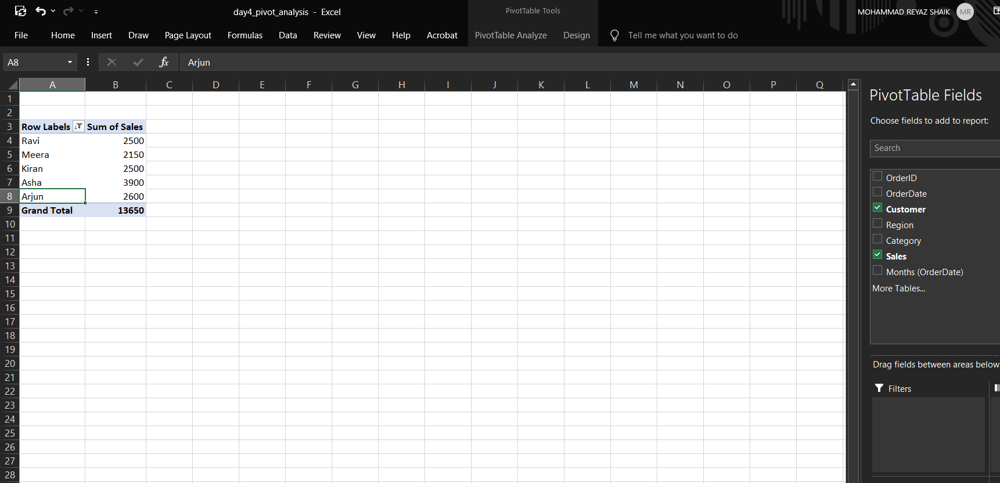

## 👋 About Me
I’m a data analytics learner building my skills and portfolio step-by-step.  
This repo tracks my progress from Excel foundations to data cleaning and beyond.

# Excel Data Analysis Portfolio – Week 1

This repository contains structured Excel projects completed as part of my Data Analyst preparation roadmap.  
The focus of this week was building strong foundations in spreadsheet analysis, lookup functions, logical operations, and structured reporting.

---

## 👤 About This Project

These projects simulate real-world business scenarios, such as HR salary analysis and merging datasets across departments. The goal was not just to use formulas, but to understand how Excel supports business decision-making.

---

## 🛠 Skills Demonstrated

- Data organization and clean spreadsheet structuring
- Relative and absolute cell referencing
- Aggregation functions (SUM, AVERAGE, COUNT, COUNTIF)
- Logical decision-making using IF
- Data merging using VLOOKUP
- Advanced lookup implementation using INDEX + MATCH
- Error handling using IFERROR
- Basic analytical thinking and insight extraction

---

## 📂 Repository Structure
projects/ → Excel project files
screenshots/ → Visual previews of analysis
README.md → Project documentation

---

# 🟢 Day 1 – Excel Fundamentals

### 📌 Project Objective
Analyze employee compensation data and apply foundational Excel functions for summary reporting.

### 🔎 Key Tasks Performed
- Calculated Total Compensation (Salary + Bonus)
- Computed Average Salary
- Counted employees per department using COUNTIF
- Applied conditional formatting to highlight high salaries

### 📊 Key Insight
Identified compensation distribution patterns across departments and highlighted high earners visually for quick managerial review.

### 📁 File
`projects/day1_excel_basics.xlsx`

Preview:

---

# 🟢 Day 2 – Logical & Lookup Functions

### 📌 Project Objective
Simulate HR–Finance data merging using Employee ID as a common key and perform salary categorization analysis.

### 🔎 Key Tasks Performed
- Merged employee and salary tables using VLOOKUP
- Implemented INDEX + MATCH as a flexible lookup alternative
- Categorized salary levels (High / Medium / Low) using IF
- Counted high earners using COUNTIF
- Compared lookup methods for robustness

### 📊 Key Insight
Identified the number of high-income employees and showed efficient table merging techniques for business reporting.

### 📁 File
`projects/day2_lookup_practice.xlsx`

Preview:

---
---

## 🟢 Day 3 – Data Cleaning & Validation

### 📌 Objective
Transform messy sales dataset into structured, consistent, analysis-ready data.

### 🔎 Cleaning Actions
- Removed duplicate records based on Order ID
- Standardized city names
- Converted Order Date to proper date format
- Replaced missing Sales values after validation
- Cleaned text formatting using TRIM/PROPER
- Validated numeric columns using SUM and AVERAGE

### 📊 Result
- Total Sales: 2600
- Average Sales: 520
- Total Orders: 5

Preview:

---
## 🟢 Day 4 – Pivot Table Business Analysis

Objective:
Analyze retail sales dataset using pivot tables to generate business insights.

Analysis Performed:
- Revenue by Region
- Revenue by Product Category
- Monthly Sales Trend
- Top 5 Customers by Revenue

Key Insights:
- Identified highest performing region
- Determined top-selling product category
- Observed monthly sales growth patterns
- Highlighted most valuable customers

## 🟢 Day 4 – Pivot Table Business Analysis

Objective:
Analyze retail sales dataset using pivot tables to generate business insights.

Analysis Performed:
- Revenue by Region
- Revenue by Product Category
- Monthly Sales Trend
- Top 5 Customers by Revenue

Key Insight:
Identified highest performing region and sales trends over time.

Preview:

## 🚀 Learning Roadmap

This repository is part of a structured progression toward advanced analytics:

- ✅ Excel Foundations  
- 🔜 SQL for Data Analysis  
- 🔜 Power BI / Tableau  
- 🔜 Python (Pandas)  

---

### 📌 Goal
To build strong analytical fundamentals and develop job-ready skills for entry-level Data Analyst roles.
